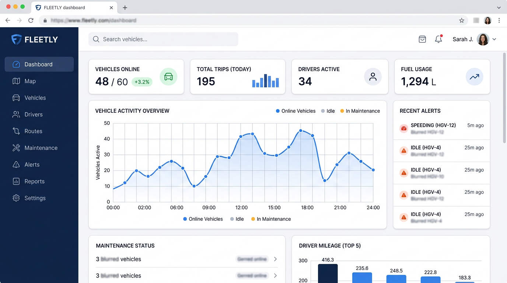
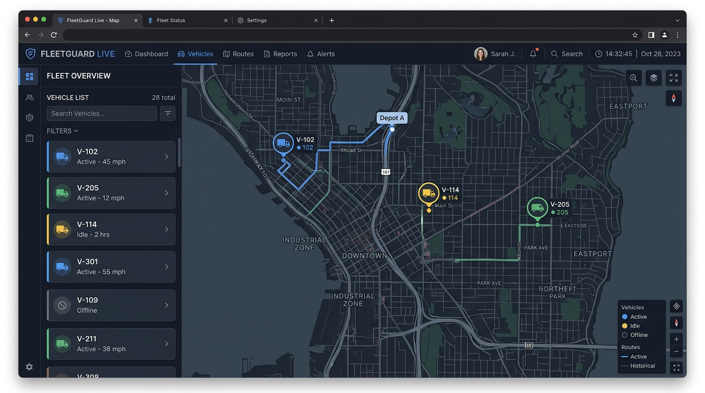
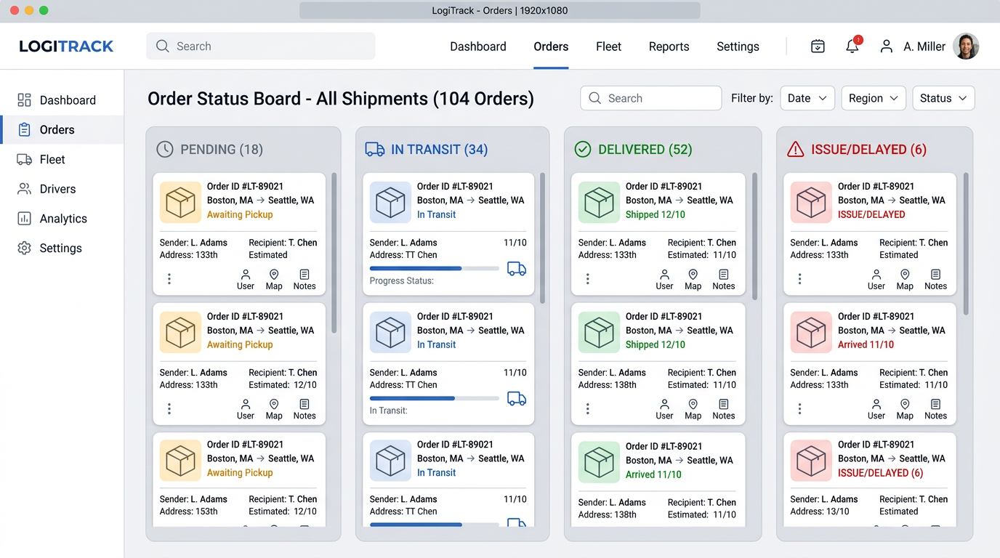

# Fleetly

React + Vite SPA for Traccar fleet management: live tracking, reports, logistics (with optional demo data or your own API), and more.

## Live demo

**Hosted demo:** [http://traccar.techdrizzle.in/](http://traccar.techdrizzle.in/) — Fleetly connected to a Traccar backend (same UI title: *Fleetly — Fleet Management*).

## Contact · TechDrizzle 2026

- **Email:** [sathasivam@techdrizzle.in](mailto:sathasivam@techdrizzle.in)
- **access:** sathasivam@techdrizzle.in/techdrizzle2026
- For questions or collaboration, you can **reach out via the chatbot** on the [demo site](http://traccar.techdrizzle.in/) (look for the site’s chat / assistant).

## Screenshots

Illustrative UI previews (see [docs/screenshots/README.md](docs/screenshots/README.md)):

| Dashboard | Live tracking | Logistics |
|-----------|----------------|-----------|
|  |  |  |

## Quick start

```bash
cp .env.example .env
# Set VITE_TRACCAR_URL to your Traccar server (see .env.example)
npm install
npm run dev
```

Dev server defaults to port **3001** and proxies `/api` to your Traccar URL.

## Scripts

| Command | Description |
|--------|-------------|
| `npm run dev` | Local dev server |
| `npm run build` | Production build → `dist/` |
| `npm run lint` | ESLint |

## Docs

- [Contributing](CONTRIBUTING.md)
- [Publish to GitHub](docs/GITHUB.md)
- [OSS / legal notes](OSS.md) · [Legal checklist](docs/LEGAL.md)

## License

MIT — see [LICENSE](LICENSE) and [NOTICE](NOTICE).
